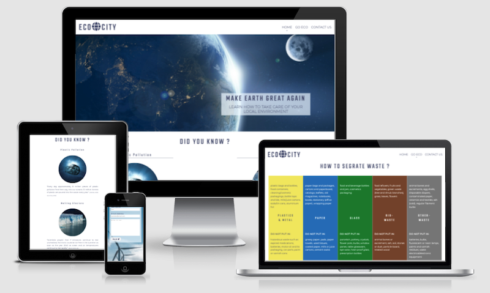
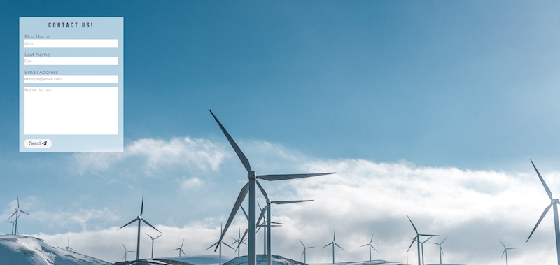

# ECOCITY
ECOCITY is a website created to provide users with essential information regarding global climate change and how everyone can contribute to improve situation worldwide starting from small everyday changes with impact to local environment.

Welcome to [ECOCITY](https://miloszmisiek.github.io/ci_p1_ecocity/)!

# Contents
- **[ECOCITY](#ecocity)**
- **[Contents](#contents)**
- **[User Experience](#user-experience)**
  - [User Stories](#user-stories)
  - [Wireframes](#wireframes)
    - [Home Page](#home-page)
    - [GO ECO Page](#go-eco-page)
    - [Contact Us Page](#contact-us-page)
  - [Layout Design](#layout-design)
    - [Fonts](#fonts)
    - [Colour](#colour)
- **[Features](#features)**
  - [Home Page](#home-page-1)
  - [GO ECO Page](#go-eco-page-1)
  - [Contact Us Page](#contact-us-page-1)
  - [Submit Page](#submit-page)
  - [Future Features](#future-features)
- **[Technologies Used](#technologies-used)**
- **[Testing](#testing)**
- **[Deployment](#deployment)**
- **[Credits](#credits)**
  - [Content](#content)
  - [Media](#media)
- **[Acknowledgements](#acknowledgements)**
# User Experience
## User Stories
- As a user, I want to see the content clearly.
- As a user, I want to know what the purpose of the website is as I open it.
- As a user, I want to access content in a very few clicks.
- As a user, I want to know what source was used to present data.
- As a user, I want to have visual representation of climate change data.
- As a user, I want to know what causes developing climate change.
- As a user, I want to know what steps I can take to help the environment.
- As a user, I want to have the option to contact creator for more information required.
- As a user, I want to access project social media, if any exist.
## Wireframes
[Balsamiq](https://balsamiq.com/) was used to create wireframes as part of project planning. They were used to discuss the concept of the website with a designated Code Institute mentor. The final project differs in some places from the original concept presented below to improve UX or responsiveness of the site.
### Home Page

### GO ECO Page

### Contact Us Page

## Site Structure
[ECOCITY](https://miloszmisiek.github.io/ci_p1_ecocity/) has 3 pages. The default loading page is [Home](https://miloszmisiek.github.io/ci_p1_ecocity/index.html). [GO ECO](https://miloszmisiek.github.io/ci_p1_ecocity/goeco.html) and [Contact Us](https://miloszmisiek.github.io/ci_p1_ecocity/contactus.html) pages can be loaded from navigation menu on the top of the site. [Submit](https://miloszmisiek.github.io/ci_p1_ecocity/submit.html) page opens when user fill the Contact Us form correctly.
## Layout Design
### Fonts
Two styles of fonts are used for the project: 'Teko' for headings and 'Montserrat' for body text elements. All fonts are backed-up with sans-serif.
### Colour
The primary colour of the website is a shade of blue with white background. Most images were selected to contrast with the chosen scheme. Blue is the dominant colour of planet Earth, and the website was created to get users attention on earth's climate change problem.
- **Body Text**

- **Waste Classes Section**

- **Hero Heading & Contact Us Form Background**

# Features
The main principle of ECOCITY site is to be intuitive and of simple construction. All elements used are based on what most websites can be found on the internet.
## Home Page
- **Navigation**
  - Location: top of the site next to logo on every page of the project.
  - It is well responsive to different viewports.
  - Logo can be clicked to bring the user back to the home page.

- **Hero Section**
  - Location: under the navigation section.
  - The hero main heading is the paraphrase of Donald Trump's presidential campaign slogan to get user attention with humour. It is followed with one sentence description of website ideology.
  - Hero background image represents the planet Earth with the Moon viewed from the satellite perspective. 
    - The intention is to show users the beauty of human's home planet, remind that we are all part of it, and everyone must contribute to the global improvements.

- **Essential Facts**
  - Location: below hero section.
  - Heading is in the form of a quiz question to puzzle the user.
  - Four sections with attached images of selected climate change facts with short text describing problems.
  - The intention is to give user a specific data about human environmental impact to reflect on the issue.

- **Footer**
  - Contains social media links, which opens in the new tab for better UX.
  - The selection of social media was based mostly used platforms at the time of project submission.
  - Author's copyright is located at a very bottom with centred, smaller text to avoid cluttering and focus attention on other content.

## GO ECO Page
- **Waste Segregation**
  - Location: below the navigation bar.
  - Heading is a question the user may encounter when dealing with recycling.
  - The purpose of this section is to make user familiar with classes of waste and how to segregate them for everyday use. It is structured in the way that top part gives user information on what is classified under the waste class, but bottom part represents what should not be put together with the segregated waste of the class.
  - Intention is to reflect user on better home waste handling to reduce waste pollution.
  - It was decided to build this section using HTML elements with cascade styling instead of pre-made-up image to allow for responsiveness.

- **Change Section**
  - Location: below the Waste Segregation section.
  - Heading is a statement that should influence the user to act accordingly to represented content. Icons were added to get user's attention.
  - Two paragraphs represent how everyone can contribute to environmental improvement.
  - The styling is mirrored from the home page 'Knowledge Section' for enhanced UX.

## Contact Us Page
- Background image was chosen to represent renewable energy sources to once more focus user attention on the topic.
- Contact Us form is in the top left corner to reduce background image cluttering.
- The contact section is limited to max-width 2000px for UX, beyond this resolution the whitespace is added on both sides of the image, to prevent the image from extensive cropping.
- Input fields are used to collect user's personal data with his email address. It will not allow user to leave the field blank or type incorrect email address format.
- Textarea allows user to type his brief message. Maximum length of the message is 350 characters to force for essential message.
- Send button reverts colours when hovered with mouse pointer to attract user.
- Contact Us form is validated only from client-site - no running server for this project.

## Submit Page
- User is redirected to submit page after filling Contact Us form correctly.
- The site uses a form element with method attribute *GET*. The decision was made after [YouTube tutorial](https://www.youtube.com/watch?v=fNcJuPIZ2WE) to omit running server for this project.
- The site provide link to home page - word *here*.

## Future Features
- Compress all images to WebP format for enhanced site performance.
- A section/page with partners supporting the project and their contact details.
  - It will help users reach out to other valuable companies focused on ecology and improve the commercial site of the project.
- A shop with merch products.
  - It will enhance project branding.
- Animation effects for better UX.
- Filtering messages by topics with use of radio buttons.
- Video content on climate change aspects and what can be bone to reduce the impact.

# Technologies Used
- [HTML5](https://html.spec.whatwg.org/) - basic site structure.
- [CSS](https://www.w3.org/Style/CSS/Overview.en.html) - cascade styling for website.
- [Balsamiq](https://balsamiq.com/wireframes/) - wireframes used at planning stage.
- [Gitpod](https://www.gitpod.io/#get-started) - cloud development platform to deploy website.
- [Github](https://github.com/) - code hosting platform to host the website.
# Testing
All various test results are presented in separate [TESTING](TESTING.md) file.
# Deployment
## Using GitHub Pages to deploy the project.
The website was deployed to GitHub pages. The steps are as follows:
1. In GitHub project repository, click on **Settings** tab.

2. On the left side, find **Pages** tab.
3. On the right side of navigation table, find **Source** section and select *main* in the *branch* tab, make sure *root* directory is selected, and press **Save**.
4. If steps were successfully followed, the green box will appear with a message that the site was deployed.

    *Until the site is published and ready to view, it can take several minutes for the server to response.*

The live link can be found here - [ECOCITY](https://miloszmisiek.github.io/ci_p1_ecocity/).
## Fork a repository.
A fork is a copy of a repository. Forking a repository allows you to freely experiment with changes without affecting the original project. The steps are as follows:
1. On the GitHub.com navigate to repository page.
2. In the top-right corner of the page, click **Fork**.

You can fork a repository to create a copy of the repository and make changes without affecting the upstream repository.
## Clone a repository.
In GitHub you have option to create a local copy (clone) of your repository on your device hard drive. The steps are as follows:
1. On the GitHub.com navigate to repository page.
2. Locate the *Code* tab and click on it.
3. In the expanded window, click the two squares icon to copy https link of the repository.

4. On your computer, open **Terminal**.
5. Navigate to the directory of choice.
6. Type **git clone** and paste the copied link of the repository.
7. Press **Enter** and the local clone of the repository will be created in the selected directory.

# Credits
## Content
- Parts of code are implemented from [Stack Overflow](https://stackoverflow.com/) and [W3Schools](https://www.w3schools.com) (marked with comments).
- Fonts are implemented using [Google Fonts](https://fonts.google.com/).
- Icons are implemented from [Font Awesome](https://fontawesome.com/).
- Colours visual representation come from [HTML Colors](https://color-term.com/html-colors/), [SchemeColor](https://www.schemecolor.com/no-easy-person.php), [Color Hexa](https://www.colorhexa.com/).
- Markdown table for Responsiveness section in TESTING file was created using [Tables Generator](https://www.tablesgenerator.com/markdown_tables).
- GitHub Deployment section come from [GitHub Docs](https://docs.github.com/en/get-started/quickstart/fork-a-repo).
- Footer and layout inspiration came from CI [Love Running](https://github.com/Code-Institute-Org/love-running-2.0) Project.
- README file and **Contact Us** submission page inspiration came from CI Student *Ewan Colquhoun* [Wawas Woods](https://github.com/EwanColquhoun/wawaswoods) Project.
- Wireframes were implemented using [Balsamiq](https://balsamiq.com/).
- Information sources:
  - 'Plastic Pollution': [Surfers Against Sewage](https://www.sas.org.uk/our-work/plastic-pollution/plastic-pollution-facts-figures/).
  - 'Melting Glaciers': [World Wildlife](https://www.worldwildlife.org/pages/why-are-glaciers-and-sea-ice-melting).
  - 'Air Pollution': [Voice of America](https://www.voanews.com/a/facts-about-air-pollution-on-world-environment-day/4946443.html).
  - 'Chemical Solvents': [Penn Jersey Paper Co](https://www.pjponline.com/the-environmental-impact-of-cleaning-products/).
  - 'Go Cycling': [Reid Bikes](https://www.reidbikes.com/2020/03/11/the-environmental-impacts-of-cycling/).
  - 'Nature is Power': [ADEC Innovations](http://blog.adecesg.com/blog/environmental-impacts-of-renewable-energy-sources).
  - 'Waste Segregation': [Czysta Bydgoszcz](https://www.czystabydgoszcz.pl/odpady-komunalne/rady-na-odpady/materialy-informacyjne/ang/), [Just Ask Poland](https://www.justaskpoland.com/new-rules-of-waste-management-in-poland/)
## Media
- Hero background image came from [Pixabay](https://pixabay.com/).
- 'Plastic Pollution', 'Melting Glaciers' and 'Air Pollution' paragraphs images came from [Unsplash](https://unsplash.com/).
- 'Chemical Solvents', 'Go Cycling', 'Nature is power' and 'Contact Us' sections images came from [Pexels](https://www.pexels.com/).
# Acknowledgements
[ECOCITY](https://miloszmisiek.github.io/ci_p1_ecocity/) website was created as part of [Code Institute](https://codeinstitute.net/) Full Stack Software Developer (e-Commerce) Diploma. I am very grateful to my mentor [Precious Ijege](https://www.linkedin.com/in/precious-ijege-908a00168/) for his time spent and guidance on this project and Code Institute for creating such an excellent web-development study tool.

Milosz Misiek 2021
