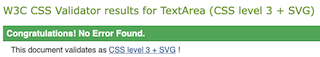
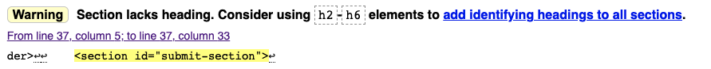
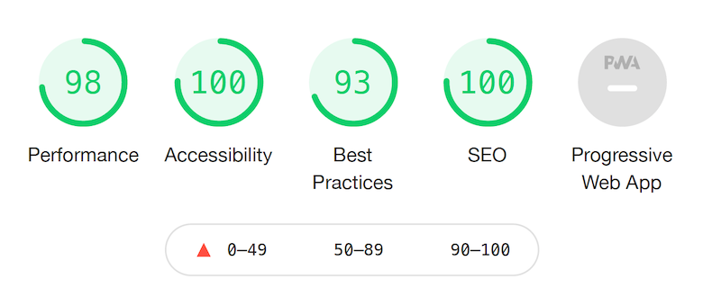
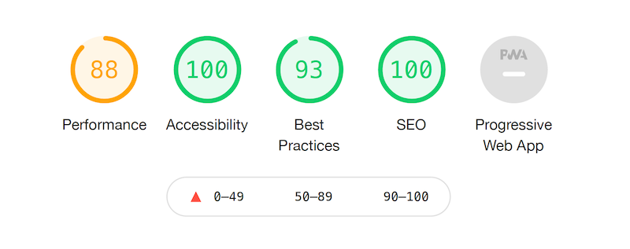

# Testing
## HTML & CSS Validators
Source codes was tested using HTML and CSS validators. No errors present.
1. HTML Validator [W3C Markup Validator](https://validator.w3.org/).
   - Home Page
  
    

   - GO ECO Page

    

   - Contact Us Page

    

   - Submit Page

    

2. CSS Validator [W3C Jigsaw](https://jigsaw.w3.org/css-validator/)

    

## Responsivnes
Responsivnes design was checked with [Google Chrome Dev Tools](https://developer.chrome.com/) and with [Am I responsive?](http://ami.responsivedesign.is/). The website responds well to different screen sizes.

## Bugs
During html code validation, 1 bug was found and resolved:
   - On Submit Page, there was no heading element. After test, the site was slightly restructured to include h2 element.
    

## Google Lighthouse

The website was tested using [Google Lighthouse](https://developers.google.com/web/tools/lighthouse) in Chrome Dev Tools for desktop and mobile versions.

- Performance - rates how your webiste responds while loading.
- Accessibility - rates the accessibility of your website to all users (including impaired ones).
- Best Practices - rates how your websites includes industry standards.
- SEO - *Search Engine Optimisation*, rates how your website is optimasied for search engine results.

### Desktop Results

### Mobile Results

First tests resulted in Performance score approx. 85%, due to large image files used on the website. After test, all images were resized to reduce their size. This process resulted in Performance score improvment up to 88% 

